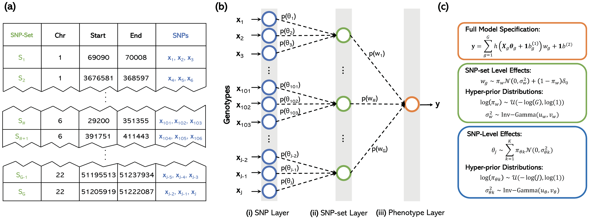

# Biologically Annoted Nerual Networks (BANNs)

**BANNs** are a class of feedforward Bayesian models with partially connected architectures that are guided by predefined SNP-set annotations.
 
 ## Installation and Dependencies
 
 We implement BANNs in three different software packages. The first two are implemented in Python using Tensorflow and numpy, respectively. The third version is implemented in R. The dependencies and requirements needed to install and run each version of the BANN software may be found in the README of the corresponding subdirectories. 
 
 ## Tutorial and Examples
 
 For each version of the software, we also provide example code and a toy dataset which illustrate how to use BANNs and conduct multi-scale genomic inference. 

## Background 

The BANN framework simply requires individual-level genotype/phenotype data and a predefined list of SNP-set annotations (see first schematic below). This translates to the following inputs for the software:
* `X`: Genotype matrix of size N-by-P, where N is the number of individuals and P is the number of SNPs.
* `y`: Phenotype file of N rows, where N is the number of individuals and each row stores the continuous phenotypic value. 
* `mask`: Mask matrix of size P-by-G, where P is the number of SNPs and G is the number of SNP-sets (e.g., genes). Each column is a vector filled with 0s and 1s, where 1 indicates that the given SNP in that row belongs to the gene in that column.  

The method can also take in summary statistics where SNP-level effect size estimates are treated as the phenotype and an estimate of the linkage disequilibrium (LD) matrix is used as input data. This translates to the alternative inputs for the software:
* `X`: LD matrix of size P-by-P, where P is the number SNPs.
* `y`: SNP-level effect sizes for each of the P SNPs, often derived by using a single-SNP GWAS method (e.g., ordinary least squares). 
* `mask`: Mask matrix of size P-by-G, where P is the number of SNPs and G is the number of SNP-sets (e.g., genes). Each column is a vector filled with 0s and 1s, where 1 indicates that the given SNP in that row belongs to the gene in that column. 

Structurally, sequential layers of the BANN model represent different scales of genomic units:
* The first layer of the network takes SNPs as inputs, with each unit corresponding to information about a single SNP.
* The second layer of the network represents SNP-sets.
All SNPs that have been annotated for the same SNP-set are then connected to the same neuron in the second layer

## Probabilistic Details about the Framework

We frame the BANN methodology as a Bayesian nonlinear mixed model with which we can perform classic variable selection. 

# NOTES
* Please make sure that the individual order (rows) of the genotype matrix X is the same with phenotype file y.
* Please make sure that the SNP order (columns) of genotype matrix X is the same with the mask file (rows). 
* We report the results according to the order of the input files. For example, the Posterior Inclusion Probabilities (PIPs) of genes are ordered in the same way to the order of the maks file (columns). 

# RELEVANT CITATIONS

# QUESTIONS AND FEEDBACK
For questions or concerns with BANNs, please contact [Pinar Demetci](mailto:pinar_demetci@brown.edu), [Wei Cheng](mailto:wei_cheng1@brown.edu), [Lorin Crawford](mailto:lorin_crawford@brown.edu).

We appreciate any feedback you may have with our software and/or instructions.

